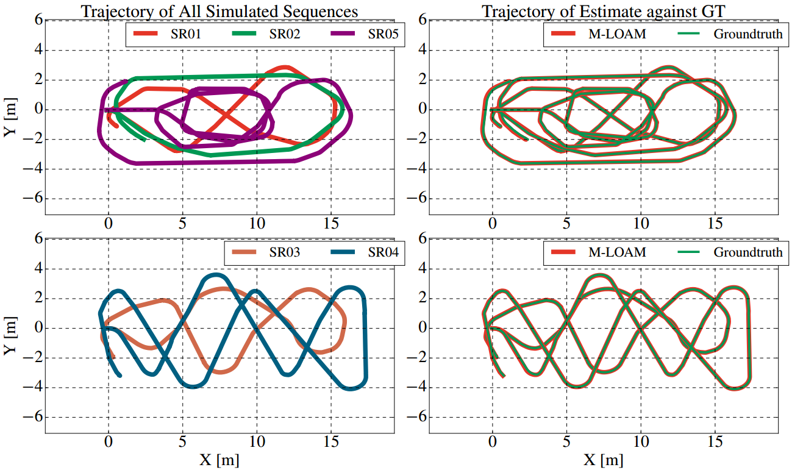
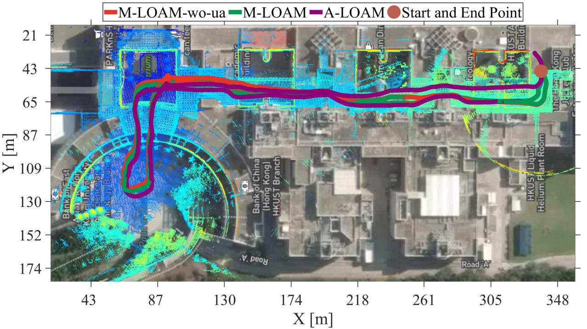

# M-LOAM
### Multi-LiDAR Odometry and Mapping

M-LOAM is a robust system for multi-LiDAR extrinsic calibration, real-time odometry, and mapping. Without manual intervention, our
system can start with several extrinsic-uncalibrated LiDARs, automatically calibrate their extrinsics, and provide accurate
poses as well as a globally consistent map.

**Authors:** 
[Jianhao Jiao](http://gogojjh.github.io), 
[Haoyang Ye](https://github.com/hyye),
[Yilong Zhu](https://scholar.google.com/citations?user=x8n6v2oAAAAJ&hl=zh-CN),
[Linxin Jiang](),
[Ming Liu](https://scholar.google.com/citations?user=CdV5LfQAAAAJ&hl=zh-CN)
from [RAM-LAB](https://www.ramlab.com)


### 1. Prerequisites
#### 1.1 **Ubuntu** and **ROS**
Ubuntu 64-bit 16.04 or 18.04.
ROS Kinetic or Melodic. [ROS Installation](http://wiki.ros.org/ROS/Installation)

#### 1.2. **Ceres Solver**
Follow [Ceres Installation](http://ceres-solver.org/installation.html).

#### 1.3. **PCL**
Follow [PCL Installation](http://www.pointclouds.org/downloads/linux.html).
> NOTE: Starting with PCL-1.7 you need to define PCL_NO_PRECOMPILE before you include any PCL headers to include the templated algorithms as well.

#### 1.4. **OpenMP**
```sudo apt install libomp-dev```

#### 1.5. **Eigen3**
```sudo apt install libeigen-dev```
> NOTE: to prevent Eigen error: https://eigen.tuxfamily.org/dox/group__TopicUnalignedArrayAssert.html

#### 1.6. **GLOG, GFLAGS, GTEST**
> NOTE: https://juejin.im/post/5dca40b9f265da4d226e397e

### 2. Build M-LOAM
```catkin build mloam```

### 3. Example
* Dataset 
  * dataset 1: [Four LiDAR dataset for testing on pingshan](http://gofile.me/4jm56/NNFbLc5cn)
  * dataset 2: [Simulation Robot](http://gofile.me/4jm56/HzMDz6cvK)
  * dataset 3: [Real Handheld Robot](http://gofile.me/4jm56/wJRrdgBwM)

* Run M-LOAM
    ```
    rosbag play xxx.bag -l 
    roslaunch mloam mloam_realvehicle.launch
    rostopic echo /extrinsics/odoms[1]/pose
    ```

### 4. Compare with A-LOAM
> mloam_handheld.launch set run_aloam:=true
```roslaunch mloam mloam_handheld.launch```

### 5. Results
**red**: odometry; **green**: mapping; **blue**: gt

* Test in Simulation <br>


* Test in HKUST <br>

    
### 6. Additional Features (have not fixed)

### 7. Acknowledgements
Thanks for 

* LOAM (J. Zhang and S. Singh. LOAM: Lidar Odometry and Mapping in Real-time) and its advanced version: [A-LOAM](https://github.com/HKUST-Aerial-Robotics/A-LOAM);
* [LIO-MAPPING](https://github.com/hyye/lio-mapping) (Haoyang Ye, Yuying Chen, and Ming Liu. Tightly Coupled 3D Lidar Inertial Odometry and Mapping).
