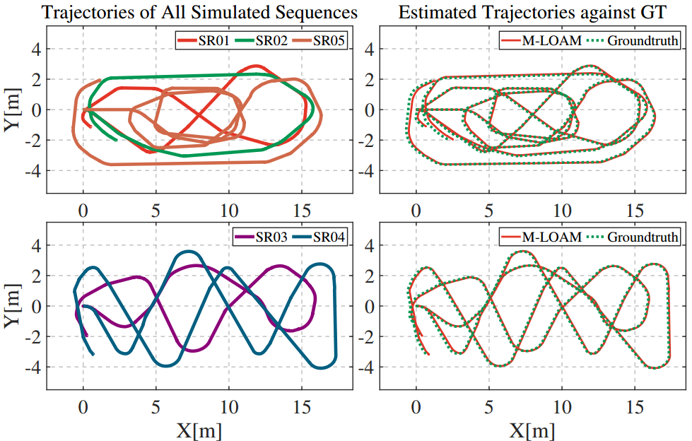
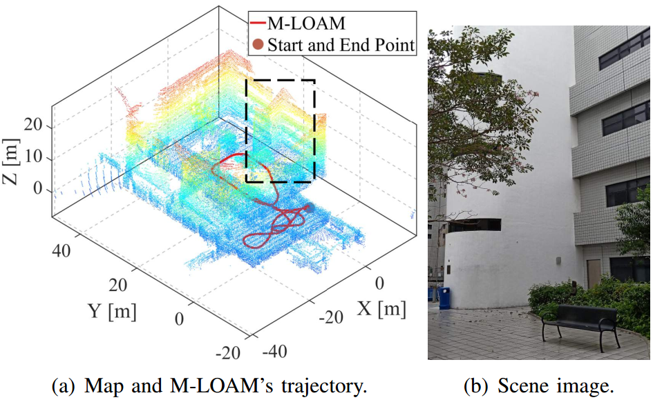
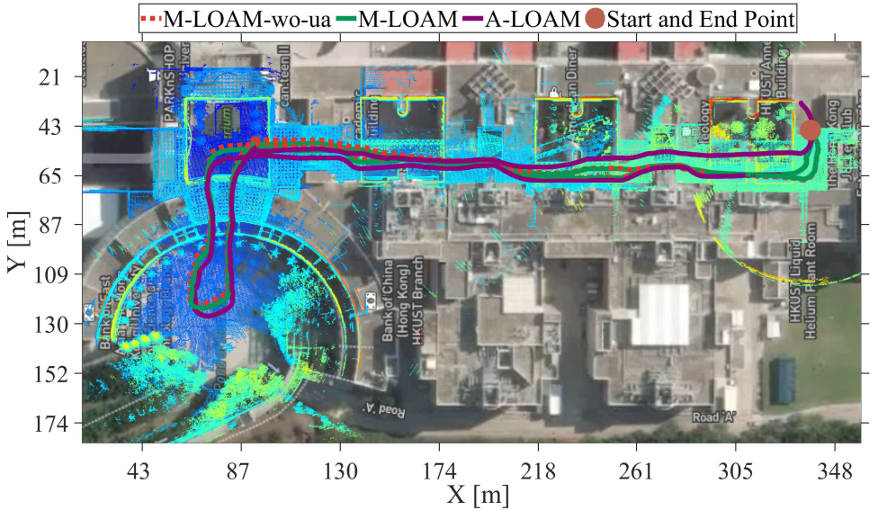
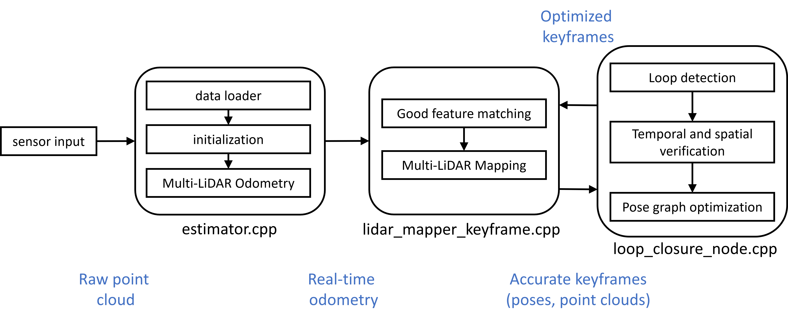

# M-LOAM
## Robust Odometry and Mapping for Multi-LiDAR Systems with Online Extrinsic Calibration
M-LOAM is a robust system for multi-LiDAR extrinsic calibration, real-time odometry, and mapping. Without manual intervention, our system can start with several extrinsic-uncalibrated LiDARs, automatically calibrate their extrinsics, and provide accurate poses as well as a globally consistent map.

**Authors:** 
[Jianhao Jiao](http://gogojjh.github.io), 
[Haoyang Ye](https://github.com/hyye),
[Yilong Zhu](https://scholar.google.com/citations?user=x8n6v2oAAAAJ&hl=zh-CN),
[Linxin Jiang](xxx),
[Ming Liu](https://scholar.google.com/citations?user=CdV5LfQAAAAJ&hl=zh-CN)
from [RAM-LAB](https://www.ram-lab.com), [HKUST](http://www.ust.hk)

**Project website:** https://ram-lab.com/file/site/m-loam

**Videos:**

<a href="https://www.youtube.com/watch?v=qFA_bVkh89Y" target="_blank"></a>

**Related Papers**
* **Robust Odometry and Mapping for Multi-LiDAR Systems with Online Extrinsic Calibration**, Jianhao Jiao, Haoyang Ye, Yilong Zhu, Ming Liu, under review. [pdf](https://arxiv.org/pdf/2010.14294.pdf)
* **Greedy-Based Feature Selection for Efficient LiDAR SLAM**, Jianhao Jiao, Yilong Zhu, Haoyang Ye, Huaiyang Huang, Peng Yun, Linxin Jiang, Lujia Wang, Ming Liu, under review.
* **MLOD: Awareness of Extrinsic Perturbation in Multi-LiDAR 3D Object Detection for Autonomous Driving**, Jianhao Jiao*, Peng Yun*, Lei Tai, Ming Liu, IEEE/RSJ International Conference on Intelligent Robots and Systems (IROS, 2020). [pdf](https://arxiv.org/abs/2010.11702.pdf)

*If you use M-LOAM for your academic research, please cite one of our paper.* [bib](https://github.com/gogojjh/M-LOAM/blob/mloam_gf/support_files/paper_bib.txt)

<!-- ----------------------------------------------------------- -->
### 1. Prerequisites
1.1 **Ubuntu** and **ROS**

Ubuntu 64-bit 16.04 or 18.04.
ROS Kinetic or Melodic. [ROS Installation](http://wiki.ros.org/ROS/Installation)

1.2. **Ceres Solver**

Follow [Ceres Installation](http://ceres-solver.org/installation.html), remember to **make install**.
<!-- (Our testing environment: Ubuntu 18.04, ROS Melodic, PCL 1.8, Eigen 3.3.3)  -->

1.3. **PCL**

Follow [PCL Installation](http://www.pointclouds.org/downloads/linux.html).

1.4. **OpenMP**
```
  sudo apt install libomp-dev
```

1.5. **Eigen3**
```
  sudo apt install libeigen-dev
```

1.6. **GLOG, GFLAGS, GTEST**

<!-- ----------------------------------------------------------- -->
### 2. Build M-LOAM on ROS
```
  cd ~/catkin_ws/src
  git clone https://github.com/gogojjh/M-LOAM.git
  cd M-LOAM
  catkin build mloam
  source ~/catkin_ws/devel/setup.bash
```

<!-- ----------------------------------------------------------- -->
### 3. Example
* [Datasets](http://gofile.me/4jm56/2iYvOr73R) collected with different platforms:
  1. Simulation Robot (SR)
  2. Real Handheld Device (RHD)
  3. Real Vechile (RV)
  4. Oxford RoboCar (OR)

* Run M-LOAM and baseline methods
  1. We provide a script to perform batch testing of M-LOAM with baseline methods
  2. Enter the script folder: ``roscd mloam/script/``
  3. Modify the python script: ``run_mloam.py`` for specific platforms with correct path
  4. Modify the shell files for methods in ``xx_main.sh``
  5. Run the python script: ``python2 run_mloam.py -program=single_test -sequence=xx -start_idx=0 -end_idx=0``

<!-- ### 5. Results -->
<!-- **red**: odometry; **green**: mapping; **blue**: gt -->
<!-- <a href="https://www.youtube.com/embed/WDpH80nfZes" target="_blank"></a> -->

<!-- * Test with SR <br>


* Test in HKUST with RHD <br>



* Test with RV <br>


* Test with Oxford RoboCar <br>
 -->

<!-- ### 6. Additional Features (have not fixed)
* Future research
  1. [on-going] Add a loop closure
  2. [] Object-centric SLAM
  3. [] Use more representative features
  4. [] Integrated with high-frequency sensors
  5. [] cross-domain, cross-modal dataset (simulator) for autonomous driving -->

<!-- ----------------------------------------------------------- -->
### 4. System pipeline
This could help you to understand the pipeline of M-LOAM. Note that **mloam_loop** is in development.


<!-- ----------------------------------------------------------- -->
### 5. Issues
I have modified the code with several times and tried different new features during the journal review process. The code style is not very perfect. Also in some sequeneces, M-LOAM may not achieve the best performence. Hope you can understand and I will try to fix them.

<!-- ----------------------------------------------------------- -->
### 6. TODO
1. Parameter tunning, and a more detailed tutorial .
2. **loop closure**.
3. **Docker** support. The initial Docker file is in the folder: ```docker/Dockerfile```
4. etc.

<!-- ----------------------------------------------------------- -->
### 6. Acknowledgements
Thanks for these great works from which we learned to write M-LOAM

* LOAM (J. Zhang and S. Singh. LOAM: Lidar Odometry and Mapping in Real-time) and its advanced version: [A-LOAM](https://github.com/HKUST-Aerial-Robotics/A-LOAM);
* [LEGO-LOAM](https://github.com/RobustFieldAutonomyLab/LeGO-LOAM)
* [LIO-MAPPING](https://github.com/hyye/lio-mapping)
* [VINS-MONO](https://github.com/HKUST-Aerial-Robotics/VINS-Mono)
* [Lidar Perception Library](https://github.com/LidarPerception/common_lib)
<!-- ----------------------------------------------------------- -->
### 7. Licence
The source code is released under [GPLv3](http://www.gnu.org/licenses/) license.

We are still working on improving the code reliability. For any technical issues, please contact Jianhao Jiao <jjiao@ust.hk>.

For commercial inquiries, please contact Prof.Ming Liu <eelium@ust.hk>.

